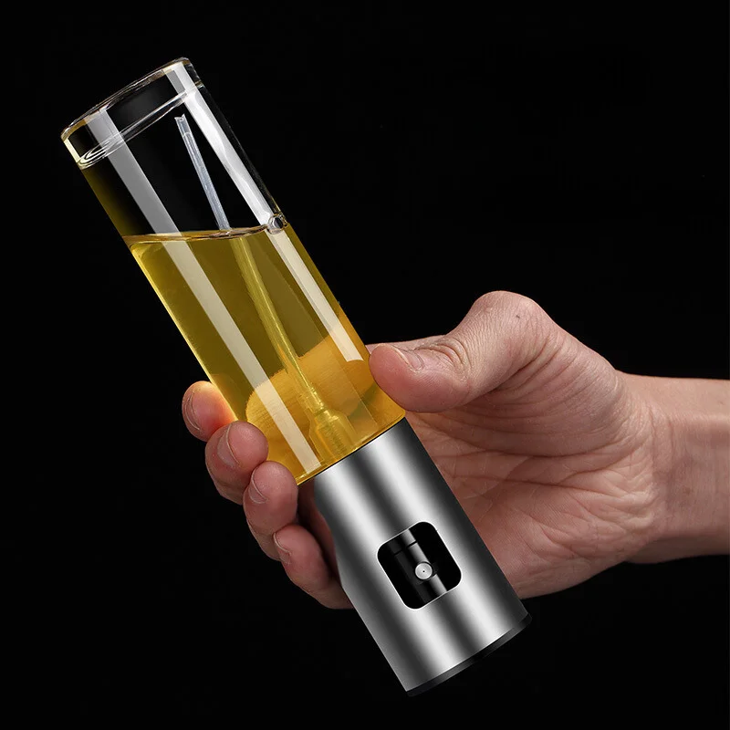
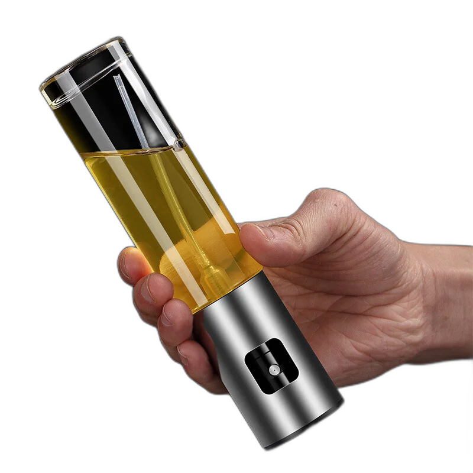

## Welcome to a Python Project! 👋

# Background Remover!

### Before - With Background



### After - Background removed



## Some code that I'm proud of
```python
import easygui
from PIL import Image
from rembg import remove

inputPath = easygui.fileopenbox(title="Select Image file")
outputPath = easygui.filesavebox(title="Save file image to")

input = Image.open(inputPath)
output = remove(input)
output.save(outputPath)
```

## Built with

- `Python >3.7, <3.13`
- [`easygui`](https://pypi.org/project/easygui/)
- [`rembg`](https://pypi.org/project/rembg/2.0.28/)

## You Can
- Select an image;
- Remove it's background;
- Save the new image.

## Author

- Website - [My GitHub](https://github.com/lucasbailo)
- Frontend Mentor - [@lucasbailo](https://www.frontendmentor.io/profile/lucasbailo)
- Instagram - [@lucassbailo](https://www.instagram.com/lucassbailo/)
- LinkedIn - [Lucas Bailo](https://www.linkedin.com/in/lcsbailo)